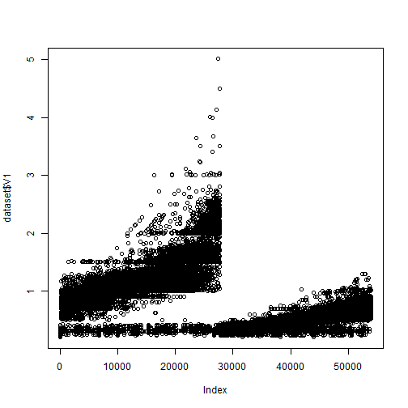

Solar panel presentation
========================================================
author: JS
date: 1/25/2015

Solar Panel explorer
========================================================


- Allow user to choose solar panel parameters
- Display performance for different voltages
- Display price 
- Compare quality of solar panels
(dummy data was used from ShinyApps)

Slide With UI Code
========================================================


```r
library(shiny)
library(ggplot2)
library(plyr)

diamonds <- rename(diamonds, c("carat" = "V1", "cut" = "V2", "color" = "V3", "clarity" = "V4", "depth" = "V5", "table" = "temperature"))
dataset <- diamonds


shinyUI(pageWithSidebar(
  
  headerPanel("Solar Panel Explorer"),
  
  sidebarPanel(
    
    sliderInput('sampleSize', 'Sample Size', min=1, max=nrow(dataset),
                value=min(1000, nrow(dataset)), step=500, round=0),
    
    selectInput('x', 'X', names(dataset)),
    selectInput('y', 'Y', names(dataset), names(dataset)[[2]]),
    selectInput('color', 'Color', c('None', names(dataset))),
    
    checkboxInput('jitter', 'Jitter'),
    checkboxInput('smooth', 'Smooth'),
    
    selectInput('facet_row', 'Quality Row', c(None='.', names(dataset))),
    selectInput('facet_col', 'Quality Column', c(None='.', names(dataset)))
  ),
  
  mainPanel(
    plotOutput('plot')
  )
))
```

<!--html_preserve--><div class="container-fluid">
<div class="row-fluid">
<div class="span12" style="padding: 10px 0px;">
<h1>Solar Panel Explorer</h1>
</div>
</div>
<div class="row-fluid">
<div class="span4">
<form class="well">
<div>
<label class="control-label" for="sampleSize">Sample Size</label>
<input id="sampleSize" type="slider" name="sampleSize" value="1000" class="jslider" data-from="1" data-to="53940" data-step="500" data-skin="plastic" data-round="0" data-locale="us" data-format="#,##0.#####" data-smooth="FALSE"/>
</div>
<label class="control-label" for="x">X</label>
<select id="x"><option value="V1" selected>V1</option>
<option value="V2">V2</option>
<option value="V3">V3</option>
<option value="V4">V4</option>
<option value="V5">V5</option>
<option value="temperature">temperature</option>
<option value="price">price</option>
<option value="x">x</option>
<option value="y">y</option>
<option value="z">z</option></select>
<script type="application/json" data-for="x" data-nonempty="">{}</script>
<label class="control-label" for="y">Y</label>
<select id="y"><option value="V1">V1</option>
<option value="V2" selected>V2</option>
<option value="V3">V3</option>
<option value="V4">V4</option>
<option value="V5">V5</option>
<option value="temperature">temperature</option>
<option value="price">price</option>
<option value="x">x</option>
<option value="y">y</option>
<option value="z">z</option></select>
<script type="application/json" data-for="y" data-nonempty="">{}</script>
<label class="control-label" for="color">Color</label>
<select id="color"><option value="None" selected>None</option>
<option value="V1">V1</option>
<option value="V2">V2</option>
<option value="V3">V3</option>
<option value="V4">V4</option>
<option value="V5">V5</option>
<option value="temperature">temperature</option>
<option value="price">price</option>
<option value="x">x</option>
<option value="y">y</option>
<option value="z">z</option></select>
<script type="application/json" data-for="color" data-nonempty="">{}</script>
<label class="checkbox" for="jitter">
<input id="jitter" type="checkbox"/>
<span>Jitter</span>
</label>
<label class="checkbox" for="smooth">
<input id="smooth" type="checkbox"/>
<span>Smooth</span>
</label>
<label class="control-label" for="facet_row">Quality Row</label>
<select id="facet_row"><option value="." selected>None</option>
<option value="V1">V1</option>
<option value="V2">V2</option>
<option value="V3">V3</option>
<option value="V4">V4</option>
<option value="V5">V5</option>
<option value="temperature">temperature</option>
<option value="price">price</option>
<option value="x">x</option>
<option value="y">y</option>
<option value="z">z</option></select>
<script type="application/json" data-for="facet_row" data-nonempty="">{}</script>
<label class="control-label" for="facet_col">Quality Column</label>
<select id="facet_col"><option value="." selected>None</option>
<option value="V1">V1</option>
<option value="V2">V2</option>
<option value="V3">V3</option>
<option value="V4">V4</option>
<option value="V5">V5</option>
<option value="temperature">temperature</option>
<option value="price">price</option>
<option value="x">x</option>
<option value="y">y</option>
<option value="z">z</option></select>
<script type="application/json" data-for="facet_col" data-nonempty="">{}</script>
</form>
</div>
<div class="span8">
<div id="plot" class="shiny-plot-output" style="width: 100% ; height: 400px"></div>
</div>
</div>
</div><!--/html_preserve-->

Slide With Server Code
========================================================


```r
library(shiny)
library(ggplot2)
library(plyr)

shinyServer(function(input, output) {
  diamonds <- rename(diamonds, c("carat" = "V1", "cut" = "V2", "color" = "V3", "clarity" = "V4", "depth" = "V5", "table" = "temperature"))
  dataset <- reactive(function() {
    diamonds[sample(nrow(diamonds), input$sampleSize),]
  })
  
  output$plot <- reactivePlot(function() {
    
    p <- ggplot(dataset(), aes_string(x=input$x, y=input$y)) + geom_point()
    
    if (input$color != 'None')
      p <- p + aes_string(color=input$color)
    
    facets <- paste(input$facet_row, '~', input$facet_col)
    if (facets != '. ~ .')
      p <- p + facet_grid(facets)
    
    if (input$jitter)
      p <- p + geom_jitter()
    if (input$smooth)
      p <- p + geom_smooth()
    
    print(p)
    
  }, height=700)
  
})
```

Slide with summary of solar panel dataset
========================================================


```r
summary(dataset)
```

```
       V1                 V2        V3              V4       
 Min.   :0.2000   Fair     : 1610   D: 6775   SI1    :13065  
 1st Qu.:0.4000   Good     : 4906   E: 9797   VS2    :12258  
 Median :0.7000   Very Good:12082   F: 9542   SI2    : 9194  
 Mean   :0.7979   Premium  :13791   G:11292   VS1    : 8171  
 3rd Qu.:1.0400   Ideal    :21551   H: 8304   VVS2   : 5066  
 Max.   :5.0100                     I: 5422   VVS1   : 3655  
                                    J: 2808   (Other): 2531  
       V5         temperature        price             x         
 Min.   :43.00   Min.   :43.00   Min.   :  326   Min.   : 0.000  
 1st Qu.:61.00   1st Qu.:56.00   1st Qu.:  950   1st Qu.: 4.710  
 Median :61.80   Median :57.00   Median : 2401   Median : 5.700  
 Mean   :61.75   Mean   :57.46   Mean   : 3933   Mean   : 5.731  
 3rd Qu.:62.50   3rd Qu.:59.00   3rd Qu.: 5324   3rd Qu.: 6.540  
 Max.   :79.00   Max.   :95.00   Max.   :18823   Max.   :10.740  
                                                                 
       y                z         
 Min.   : 0.000   Min.   : 0.000  
 1st Qu.: 4.720   1st Qu.: 2.910  
 Median : 5.710   Median : 3.530  
 Mean   : 5.735   Mean   : 3.539  
 3rd Qu.: 6.540   3rd Qu.: 4.040  
 Max.   :58.900   Max.   :31.800  
                                  
```


Slide with sample plot of V1
========================================================

```r
plot(dataset$V1)
```

 
